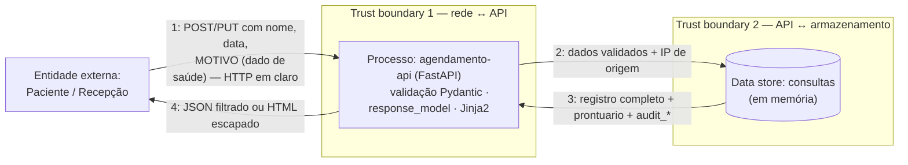

# AT — Exercício 3: Tríade CIA, frameworks de referência e DFD

O sistema trata dados de saúde (nome do paciente, especialidade e, sobretudo, o `motivo` da consulta), então a confidencialidade tem peso maior nesta análise, como aponta o enunciado.

## Tríade CIA

| Pilar | Situação atual | Lacuna |
|---|---|---|
| **Confidencialidade** | `ConsultaResponse` impede que o prontuário e a auditoria saiam na API; os templates só referenciam campos públicos (Ex. 2) | **Crítica.** Não há autenticação: qualquer um lê nome, especialidade e motivo de todos os pacientes, por `GET /consultas` ou pela página. Ids sequenciais tornam a enumeração trivial. Tráfego em HTTP puro |
| **Integridade** | Pydantic valida tipo, tamanho e `data_hora` futura; `extra="forbid"`; status inicial definido pelo servidor | Qualquer cliente anônimo cria, remarca, cancela ou apaga qualquer consulta (`PUT`/`DELETE` sem autenticação nem ownership). `paciente` é texto livre. `DELETE` é físico |
| **Disponibilidade** | Uvicorn assíncrono; `max_length` limita cada registro | Armazenamento só em memória (reinício apaga tudo). Sem rate limiting, sem paginação |

## Frameworks de referência → controles já implementados

| Framework | Item | Controle | Onde |
|---|---|---|---|
| **OWASP API** | API3:2023 BOPLA (Excessive Data Exposure) | `response_model=ConsultaResponse` filtra prontuário e auditoria | [models/consulta.py](../app/models/consulta.py) |
| **OWASP API** | API3:2023 BOPLA (Mass Assignment) | `extra="forbid"` + schema de entrada sem `status`/`audit_*` | [models/consulta.py](../app/models/consulta.py) |
| **OWASP Web** | A03:2021 Injection (XSS) | Auto-escape do Jinja2, sem `\|safe` | [templates/consulta_detalhe.html](../app/templates/consulta_detalhe.html) |
| **NIST SSDF** | PW.4 (reuso de software confiável) | `venv` isolado + `requirements.txt` fixado | [requirements.txt](../requirements.txt) |
| **MITRE CWE** | CWE-79 (XSS) | Mesmo auto-escape, como fraqueza de código | TB1, saída HTML |
| **MITRE CWE** | CWE-200 (exposição de informação) | `ConsultaResponse` | TB1, saída JSON |

A OWASP classifica o risco, a CWE descreve a fraqueza de código e o NIST SSDF cobre práticas do ciclo de desenvolvimento.

## DFD

- **TB1 (cliente ↔ API)**: tudo que chega é não confiável. Nessa fronteira estão os controles já implementados (validação na entrada, `response_model` e auto-escape na saída) e as maiores lacunas (sem autenticação, sem TLS).
- **TB2 (API ↔ armazenamento)**: só a API acessa o data store; prontuário e auditoria existem só deste lado.

### Fluxo de dado sensível

O fluxo mais crítico é o **4** (dado de saúde de volta ao cliente). O `response_model` resolve **quais campos** atravessam a TB1, mas nada controla **para quem**: nome e motivo saem para qualquer cliente anônimo.
