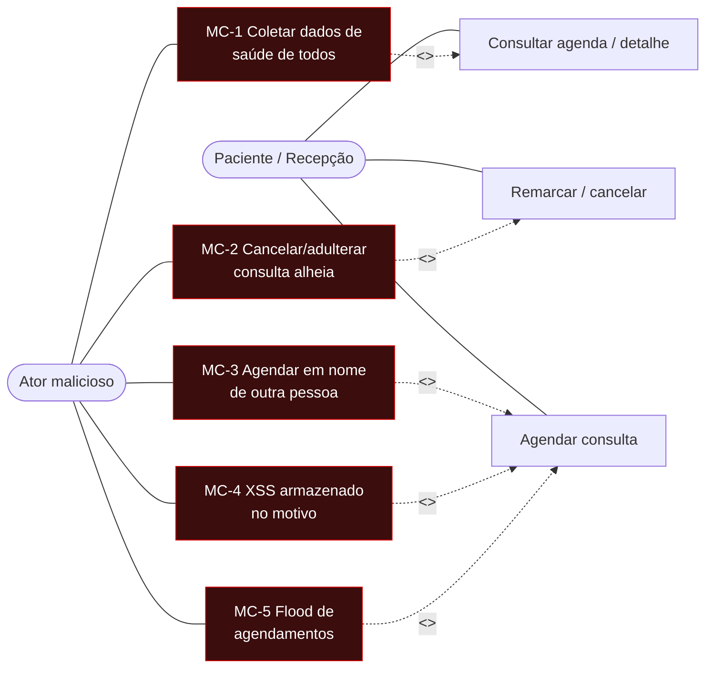

# AT — Exercício 4: Misuse cases, STRIDE e threat model

Ponto de partida: a API dos Exercícios 1 e 2, com o recurso `consultas`, as páginas HTML e os controles de saída, mas **sem autenticação ou autorização**. Cada ameaça é avaliada no pior cenário, como se nenhum controle existisse. As ameaças recebem ids (`AM-xx`) para serem referenciadas na correção e nos testes dos exercícios seguintes.

## 1. Misuse cases

| # | Caso de abuso | Caminho do ataque | Impacto |
|---|---|---|---|
| MC-1 | Coleta em massa de dados de saúde | `GET /consultas` devolve tudo; ou iterar `/consultas/{id}` (ids sequenciais) | Vazamento do histórico de saúde de toda a base |
| MC-2 | Adulterar/cancelar consulta alheia | `PUT`/`DELETE /consultas/{id}` sem ownership | Paciente perde atendimento; `DELETE` físico apaga sem rastro |
| MC-3 | Agendar em nome de terceiro | `POST /consultas` com `paciente` de texto livre | Consultas falsas atribuídas a pessoas reais |
| MC-4 | XSS armazenado no motivo | `motivo` com `<script>` executado na página da recepção | Comprometimento de conta com acesso à agenda |
| MC-5 | Flood de agendamentos | Milhares de `POST` sem rate limit | Agenda poluída; memória esgotada (DoS) |

**Priorização:** MC-1 (maior impacto, menor esforço, silencioso) > MC-2 (dano irreversível ao registro) > MC-3 > MC-5 (barulhento) > MC-4 (já mitigado pelo auto-escape do Ex. 2; na lista por risco de regressão).

## 2. STRIDE por componente

Componentes: API de consultas, páginas HTML, armazenamento, e a camada de autenticação (futura, modelada antes de existir).

| Id | Componente | STRIDE | Ameaça |
|---|---|---|---|
| AM-01 | API | Spoofing | `paciente` é texto livre; nenhuma rota exige identidade (MC-3) |
| AM-02 | API | Tampering | `PUT` sem ownership; status arbitrário (MC-2) |
| AM-03 | API | Repudiation | Sem log de quem criou/alterou; `PUT` não registra nada |
| AM-04 | API | Information Disclosure | Dado de saúde de todos para qualquer um; id sequencial (MC-1) |
| AM-05 | API | Denial of Service | `POST` sem rate limit; listagem sem paginação (MC-5) |
| AM-06 | API | Elevation of Privilege | Anônimo executa operações de recepção/médico |
| AM-07 | Páginas | Tampering | XSS armazenado — mitigado; risco de regressão por `\|safe` (MC-4) |
| AM-08 | Páginas | Information Disclosure | Lista pública mostra a agenda inteira |
| AM-09 | Páginas | Spoofing/Tampering | Sem `X-Frame-Options`/CSP nem HSTS/TLS |
| AM-10 | Armazenamento | Information Disclosure | Prontuário e auditoria convivem com os dados públicos |
| AM-11 | Armazenamento | Tampering/Repudiation | Remoção física apaga o registro e a trilha |
| AM-12 | Armazenamento | Denial of Service | Dicionário em memória, sem limite; reinício = perda total |
| AM-13 | Auth (futura) | Spoofing | Senha fraca/em claro permite personificar |
| AM-14 | Auth (futura) | Information Disclosure | PII no JWT; login diferencia "não existe" de "senha errada" |
| AM-15 | Auth (futura) | Denial of Service | Brute force no login |
| AM-16 | Auth (futura) | Elevation of Privilege | Token sem validar assinatura/`exp`/`aud`/escopo (BOLA/BFLA) |

## 3. Threat model consolidado

### Ativos

| Ativo | Impacto se comprometido |
|---|---|
| Dados de saúde (`motivo`, `especialidade` + nome) | Máximo: vazamento de condição de saúde do paciente |
| Identificação do paciente (`prontuario_paciente`) | Alto: correlaciona o histórico da pessoa |
| Trilha de auditoria (`audit_*`) | Alto: base do não-repúdio |
| Agenda (`medico`, `data_hora`, `status`) | Médio: disponibilidade e faturamento |
| Credenciais e tokens (futuro) | Máximo: dá acesso a tudo acima |

### Superfície de ataque

Hoje **100% das rotas são públicas**: `/`, `/consultas` (GET/POST), `/consultas/{id}` (GET), `/pagina/...`, além de `/docs` e `/openapi.json`. A superfície planejada (`/usuarios`, `/token`) nasce protegida no Exercício 6.

### Ameaças, risco e mitigação

| Id | Risco | Mitigação | Verificação |
|---|---|---|---|
| AM-04 | Crítico | Auth + ownership central; `404` para não-dono; listagem filtrada | sem token → `401`; token alheio → `404` |
| AM-02 | Crítico | Ownership no `PUT`; transições por papel | não-dono → `404` |
| AM-06 | Crítico | RBAC com escopos por papel | papel errado → `403` |
| AM-01 | Alto | `paciente` da base, profissional do token | corpo com `profissional` rejeitado |
| AM-11 | Alto | `DELETE` como cancelamento lógico | registro sobrevive com status `cancelada` |
| AM-16 | Alto | `alg` explícito, `exp`/`aud`/assinatura | token forjado → `401` |
| AM-13 | Alto | bcrypt; MFA para admin | hash no armazenamento, nunca a senha |
| AM-09 | Alto | HSTS, `X-Frame-Options`, `X-Content-Type-Options`, CORS allowlist | headers presentes |
| AM-05/15 | Médio | Rate limit no login | 6ª tentativa → `429` |
| AM-14 | Médio | `sub` opaco; resposta idêntica no login | payload sem PII; 401 genérico |
| AM-12 | Médio | Persistência em banco | sobrevive ao reinício |

As três ameaças críticas têm a mesma causa, ausência de identidade e autorização.
