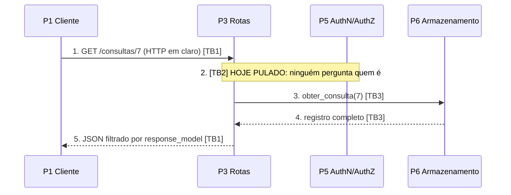

# AT — Exercício 5: Arquitetura de segurança, partições e vetores de ataque

## 1. Partições do sistema

| # | Partição | Composição |
|---|---|---|
| P1 | Clientes | Navegador, cliente HTTP, sistema externo (laboratório) |
| P2 | Borda | Uvicorn, porta exposta. Hoje sem TLS e sem gateway |
| P3 | Rotas | [routes/consultas.py](../app/routes/consultas.py), [routes/paginas.py](../app/routes/paginas.py) |
| P4 | Contratos | [models/consulta.py](../app/models/consulta.py) e [templates/](../app/templates/) |
| P5 | AuthN/AuthZ | Futuro `security.py` (JWT, escopos, ownership) — ainda não existe |
| P6 | Armazenamento | [database/consultas_db.py](../app/database/consultas_db.py) |

## 2. Fronteiras de confiança

- **TB1 (P1 ↔ P2/P3)**: fronteira de rede; toda requisição a cruza. Hoje o único controle é a validação de formato.
- **TB2 (P3 ↔ P5)**: uma rota sensível deveria delegar identidade e permissão a P5. **Hoje não é cruzada** — as rotas vão direto ao armazenamento.
- **TB3 (P3 ↔ P6)**: onde vivem prontuário e auditoria; nada pode voltar ao cliente sem passar pelo filtro de P4.

## 3. Fluxo de dados (detalhe de consulta)

O passo 5 já funciona (filtro em P4). O passo 2 mostra a lacuna: o dado de saúde do paciente 7 é entregue a qualquer um que troque o número da URL.

## 4. Vetores de ataque nos três eixos

### Design (contrato da API)
- O contrato não tem conceito de dono nem de papel: paciente, recepção, médico e laboratório teriam o mesmo poder.
- `GET /consultas` devolve a base inteira, sem filtro nem paginação, mesmo autenticado, continuaria entregando dados de todos.
- `DELETE` físico e `PUT` com status arbitrário não modelam o ciclo de vida da consulta.

### Implementação (código)
- Nenhuma rota declara dependency de autenticação; `paciente` vem do corpo.
- A proteção contra XSS depende de uma linha de template sem `|safe`, e a contra vazamento de todo endpoint lembrar do `response_model`, um endpoint novo nasce vulnerável.

### Infraestrutura (o que é alcançável pela rede)
- HTTP sem TLS: dado de saúde (e, no futuro, senhas e JWT) em claro.
- Uvicorn exposto direto, sem gateway para rate limit, allowlist de IP ou bloqueio de `/docs`.
- Armazenamento em memória, sem backup; reinício é perda total.

## 5. Por que os três eixos

Uma autenticação bem escrita (implementação) ainda entrega a base inteira se o contrato de `GET /consultas` não filtra (design); um contrato bem desenhado não protege o dado no caminho se a infraestrutura serve HTTP em claro; e nenhum gateway corrige uma rota que esquece o `response_model`. Cada eixo fecha um caminho que os outros não enxergam.

## 6. Entrada para o Exercício 6

O modelo de autorização recomendado é **híbrido: RBAC por papel (escopos no JWT) + ownership por recurso**. RBAC sozinho não distingue o paciente A do B, que têm o mesmo papel, e é essa distinção que protege o dado de saúde. O laboratório externo usa um fluxo próprio (M2M), detalhado no Exercício 7.
